# 골든타임 확보를 위한 지형 기반 최적 대피로 탐색 시스템

## I. 서론

재난이나 응급 상황에서 **‘시간’은 곧 생명**이다.
2024년 한겨레 보도에 따르면, 응급실까지 1시간 이상 걸린 환자가 단 3개월 동안 7,900명에 달했으며, 이송 지연으로 골든타임을 놓친 환자가 전년 대비 40% 이상 증가했다. 이는 단순한 수치가 아니라, 이동 경로의 효율성이 환자의 생존률에 직접적인 영향을 미친다는 사실을 보여준다.

메디포뉴스 보도에서는 ‘30분 이내 이송’이 생존율을 좌우한다는 연구 결과가 제시되었다. 응급실 도착까지 30분 내에 이송된 환자는 사망률과 중증 뇌손상률이 약 53% 감소했으며, 반대로 5분이 지연될 때마다 사망률이 16% 증가했다고 한다.
이처럼 응급 이송은 단순한 거리 문제가 아닌 시간 단위의 생존 변수로 작용한다.

이에 따라 소방청은 2025년 「골든타임 7분 사수」 정책을 발표하고, 신고 후 7분 이내 현장 도착을 목표로 하는 ‘119패스’ 긴급 출입 시스템을 전국적으로 확대 중이다.
특히 화재의 경우 8분이 지나면 건물 내 대부분의 물체가 발화·가열되어 생존 가능성이 급격히 낮아진다는 실험 결과도 이러한 정책의 근거가 된다.
즉, 최단 경로 확보는 단순한 효율의 문제가 아니라 생존율을 결정짓는 구조적 과제이다.

<div style="display: flex; justify-content: space-around; align-items: center;"> 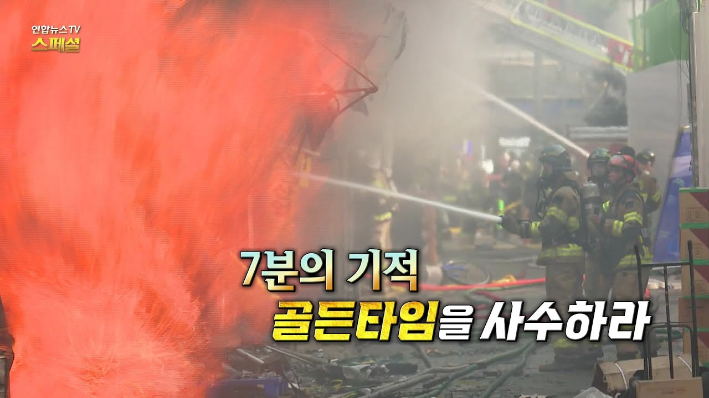 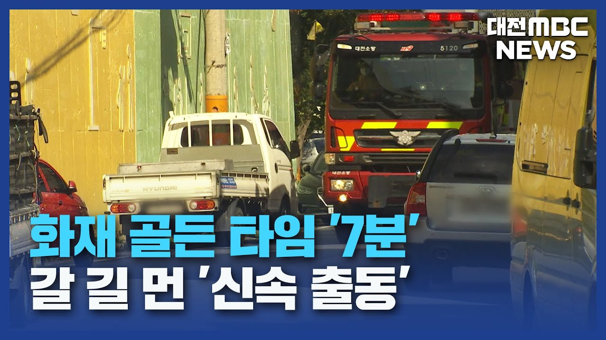 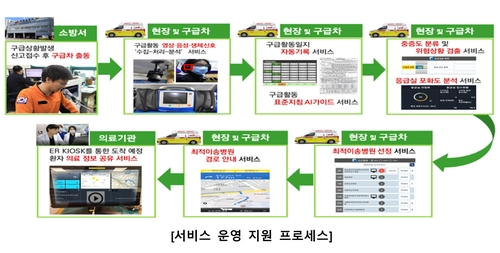 </div> <br>

본 연구는 이러한 사회적 문제의식에서 출발하였다. 재난이나 응급 상황에서의 골든타임 확보를 목표로, 복잡한 지형과 환경 속에서도 사람이 실제로 이동할 수 있는 최적 경로를 찾아내는 방법을 탐구하였다. 이를 통해 단순히 ‘가장 짧은 거리’를 계산하는 것을 넘어, 지형적 제약·통행 가능성·시간 효율성을 모두 고려한 현실적인 경로 탐색 방안을 제시하고자 한다.


## II. 기술적 배경


### 1. Object Detection

위성영상에서의 객체 탐지는 단순히 물체를 구분하는 작업이 아니라,  
**사람이 실제 이동할 수 있는 영역(도로, 인도, 개활지 등)** 과  
**이동이 불가능한 영역(건물, 산림, 수역 등)** 을 분리하는 핵심 단계이다.

객체 탐지(Object Detection) 또는 세그멘테이션(Segmentation)은  
입력 영상 $ I(x, y) $를 각 클래스 $ C_k $로 분류하는 함수 $ f_\theta $를 학습한다.

$$
f_\theta: \mathbb{R}^{H \times W \times 3} \rightarrow \{C_1, C_2, ..., C_K\}^{H \times W}
$$

여기서 $ C_k \in \{\text{도로}, \text{건물}, \text{하천}, \text{산림}, ...\} $이다.  
학습은 주로 교차 엔트로피 손실로 진행된다.

$$
\mathcal{L}_{seg} = - \sum_{x,y} \sum_{k=1}^{K} p_{k}(x,y) \log q_{k}(x,y)
$$

- $ p_k(x,y) $: 정답(one-hot) 분포  
- $ q_k(x,y) = f_\theta(I(x,y)) $: 모델의 예측 확률  

이 결과를 통해 픽셀 단위의 라벨맵(Label Map)이 만들어지고,  
이를 **벡터화(Polygonization)** 하여 Shapefile(SHP)로 변환한다.  
이 SHP 파일은 이후 경로 탐색의 **가중치 지도(Weight Map)** 로 활용된다.

---

### 2. Super-Resolution

위성영상의 해상도가 낮을 경우, 객체 경계가 흐려지고  
세그멘테이션 모델이 경계선을 잘못 예측하는 문제가 발생한다.  
이를 해결하기 위해 **Super-Resolution (초해상도 복원)** 기법을 적용한다.

Super-Resolution의 기본 수식은 다음과 같다:

$$
I_{HR} = G_\phi(I_{LR}) \quad \text{with} \quad \min_\phi \; \mathcal{L}(I_{HR}, \hat{I}_{HR})
$$

- $ I_{LR} $: 저해상도 입력 영상  
- $ I_{HR} $: 고해상도 목표 영상  
- $ G_\phi $: 복원 네트워크 (예: EDSR, ESRGAN 등)  
- $ \mathcal{L} $: 복원 손실 (MSE, Perceptual Loss 등)

대표적으로 **ESRGAN** 은 다음과 같은 Perceptual + Adversarial 손실을 사용한다:

$$
\mathcal{L}_{total} = \mathcal{L}_{pixel} + \lambda_1 \mathcal{L}_{perceptual} + \lambda_2 \mathcal{L}_{adv}
$$

이를 통해 영상의 구조적 세부정보(도로 경계, 하천 윤곽 등)를 강화하고,  
후속 단계의 **세그멘테이션 정확도(Intersection-over-Union, IoU)** 를 향상시킨다.

---

### 3. DCT (Discrete Cosine Transform)

DEM(Digital Elevation Model)은 일정 격자 간격으로 고도를 샘플링한 행렬 $ Z[i,j] $ 이다.  
그러나 격자 간격이 90m 수준이면, 표면이 계단형으로 나타나 **비연속적인 고도 변화** 가 발생한다.  
이를 연속 함수 $ f(x, y) $로 근사하기 위해 **이산 코사인 변환(DCT)** 을 사용한다.

DCT-II 변환식은 다음과 같다:

$$
F(u,v) = \alpha(u)\alpha(v) 
\sum_{x=0}^{M-1}\sum_{y=0}^{N-1} 
Z(x,y) \cos\left[\frac{\pi(2x+1)u}{2M}\right] 
\cos\left[\frac{\pi(2y+1)v}{2N}\right]
$$

복원식(Inverse DCT)은 다음과 같다:

$$
f(x,y) = 
\sum_{u=0}^{M-1}\sum_{v=0}^{N-1}
\alpha(u)\alpha(v)F(u,v)
\cos\left[\frac{\pi(2x+1)u}{2M}\right]
\cos\left[\frac{\pi(2y+1)v}{2N}\right]
$$

여기서
$$
\alpha(u) = 
\begin{cases}
\frac{1}{\sqrt{M}}, & u = 0 \\
\sqrt{\frac{2}{M}}, & u > 0
\end{cases}
$$

DCT 계수 $ F(u,v) $ 중 저주파 영역(작은 u,v)만 남기고 고주파를 제거하면  
**지형의 완만한 변화는 유지하면서 잡음(Noise)과 계단 효과를 억제** 할 수 있다.  
즉, $ f(x,y) $는 DEM의 **연속적이고 부드러운 근사 함수** 로 동작한다.

---

### 4. A* (A-star) 알고리즘

A* 알고리즘은 **휴리스틱(Heuristic) 기반의 최단경로 탐색** 알고리즘이다.  
각 노드 \( n \)에 대해 총비용 \( f(n) \)을 아래와 같이 정의한다:

$$
f(n) = g(n) + h(n)
$$

- $ g(n) $: 시작점에서 현재 노드까지의 실제 누적 비용  
- $ h(n) $: 목표점까지의 추정 비용 (Heuristic)

8방향 격자에서 휴리스틱으로는 **유클리드 거리** 또는 **옥타일 거리**를 사용한다.

$$
h(n) = \sqrt{(x_{goal} - x_n)^2 + (y_{goal} - y_n)^2}
$$

또는

$$
h(n) = D \cdot (dx + dy) + (D_2 - 2D) \cdot \min(dx, dy)
$$

- $ D, D_2 $: 이동 단가 (보통 D=1, D₂=√2)  
- $ dx = |x_{goal} - x_n|, \; dy = |y_{goal} - y_n| $

가중치(Weight) 지도를 $ W(x,y) $라 하면,  
각 간선의 이동 비용은 고도차와 가중치를 함께 고려해 다음과 같이 정의된다:

$$
c(n,m) = W(x_m, y_m) \cdot \sqrt{(x_m-x_n)^2 + (y_m-y_n)^2} \cdot (1 + \lambda |\nabla f(x_m, y_m)|)
$$

여기서
- $ |\nabla f| $: 고도 변화율 (경사도 기반 페널티)
- $ \lambda $: 경사 민감도 조절 계수  

결과적으로, A*는 단순히 **가장 짧은 거리** 가 아니라  
“**가장 이동이 용이하고, 실제 지형을 반영한 경로**”를 찾게 된다.


## III. 구현

### 1. Yolo segmentation

- 환경공간정보서비스(https://aid.mcee.go.kr/) 에는 다음과 같이 토지피복지도를 제공한다.

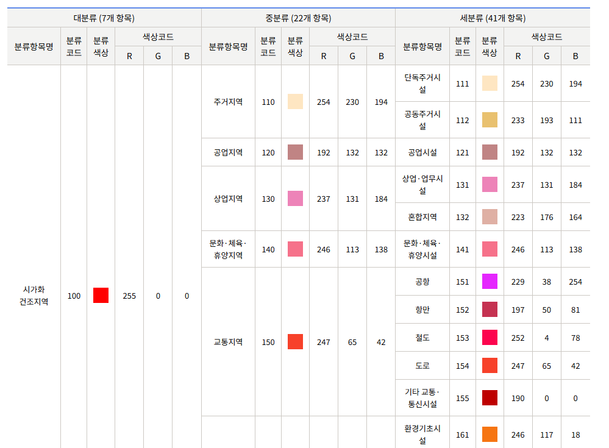

- 사진과 같이 41개의 세분류로 shp파일을 제공한다. YOLO-segmentation을 이용해서 아래와 같이 41개의 객체를 위성지도로부터 추출하는 것을 목표로 한다.

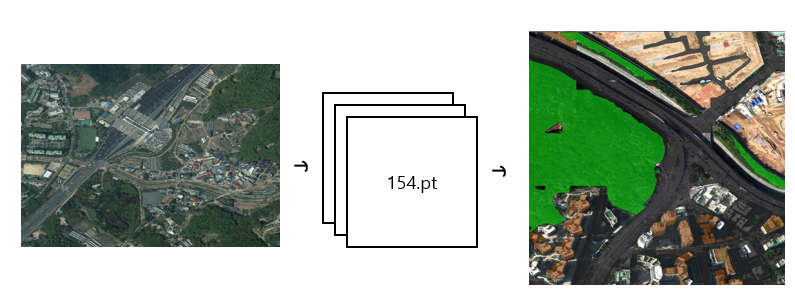


- Ultralytics의 yolov11-seg.pt을 베이스모델로 하여 해당 데이터에 맞게 파인튜닝을 진행하였다.

- 위성지도의 zoom level = 18 인 상태로 타일링을 진행하고, segmentation을 라벨링을 진행하여 클래스별로 평균 2,500개의 데이터를 학습 진행시켰다.

- 대전의 위성사진을 기반으로 추출을 진행한 결과 아래와 같이 추출할 수 있었다.


<video controls src="img/segmentation.mp4" title="Title"></video>


### 2. SuperResolution

- 위의 segmentation의 더 좋은 성능의 detection을 내기 위해, 더 높은 품질의 사진해상도가 필요함을 식별하였다. 그렇기에 SuperResolution 기법을 선처리로 하고 추출을 진행하기로 하였다.

- .tif 파일에는 단순히 사진 정보만 있는 것이 아닌, 위치정보 등 다양한 메타데이터가 있기 때문에 아래의 단계를 거쳐야 한다.

```
1. .tif 파일의 메타데이터를 별도로 저장 -> data
2. .tif 파일을 .png형식의 데이터로 분할 -> {z = 18}/{x}/{y}.png 형식으로 저장
3. 각각에 대해서 업스케일링 진행
4. 해당 .png파일을 다시 병합한 뒤, 메타데이터(data)를 얹어서 tif파일 재구성
```

해당 결과는 아래와 같이 나오는 것을 확인할 수 있다.

<video controls src="img/SuperResolution.mp4" title="Title"></video>

- 해당 과정을 거치고 나서 대전 지역을 SuperResolution -> Yolo-segmentation 검출 한 결과 아래와 같다.

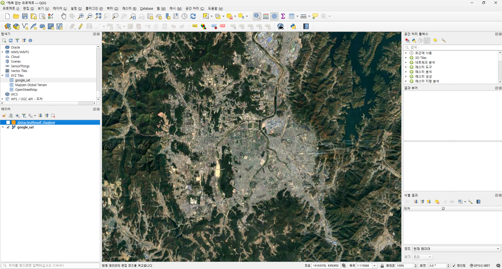

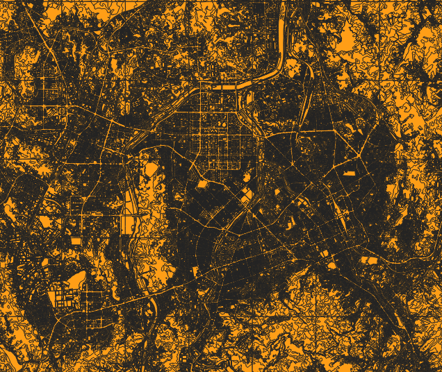


### 3. DEM 데이터 DCT 변형

- 공공데이터 포털(https://www.data.go.kr/)에서 전국 고도 데이터를 받을 수 있었다.
- 하지만 해당 데이터는 90m 급 데이터였기에, DCT 변형이 필요하다고 판단하였다.
- 토지피복지도의 좌표계랑 통일하기 위해서 EPSG:3857 투영법에 맞게 변환작업을 하였다.

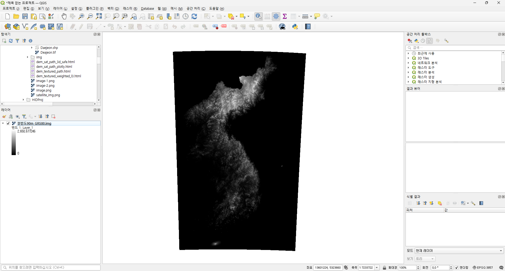

- 그중에서 대전 지역을 잘라서 변형을 진행하였다.

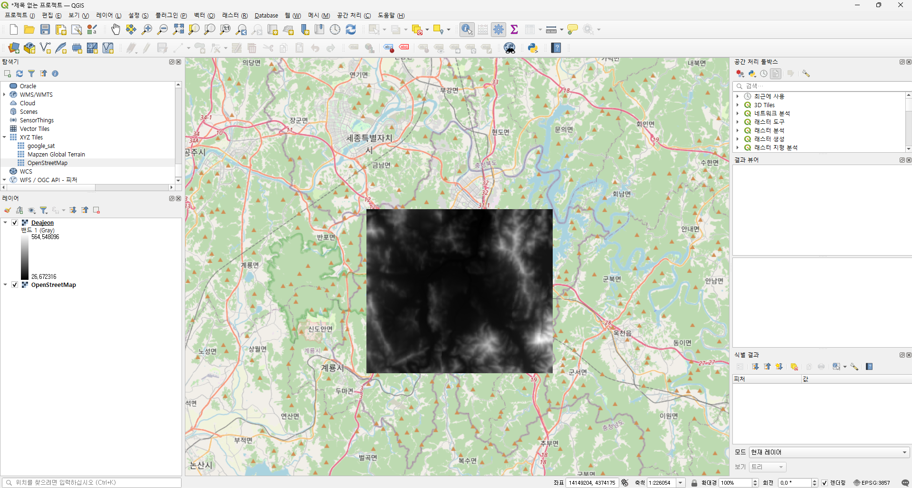

- 해당 데이터의 처리 결과는 아래와 같으며, 원본과 큰 왜곡이 없는 것을 확인할 수 있다.

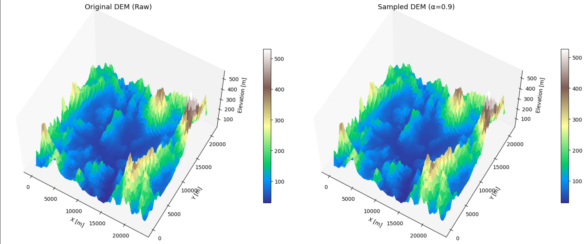

- 추출된 수식은 다음과 같다.

$$
f(x, y) = 
\sum_{k=0}^{K_c} \sum_{\ell=0}^{L_c}
A_{k\ell}
\cos\left( \frac{\pi k x}{W_m} \right)
\cos\left( \frac{\pi \ell y}{H_m} \right)
$$


| 항목 | 값 | 의미 |
|------|------|------|
| shape | (180, 204) | Shape($ A_{kl} $) |
| $W_m$ | 20,538.49 | 전체 X축 길이 (m) |
| $H_m$ | 23,292.26 | 전체 Y축 길이 (m) |
| $Kc$, $Lc$ | (81, 91) | DCT 계수 한계 인덱스 |

<br>

- 해당 Mesh에 위성사진을 올리면 다음과 같이 나오게 된다.

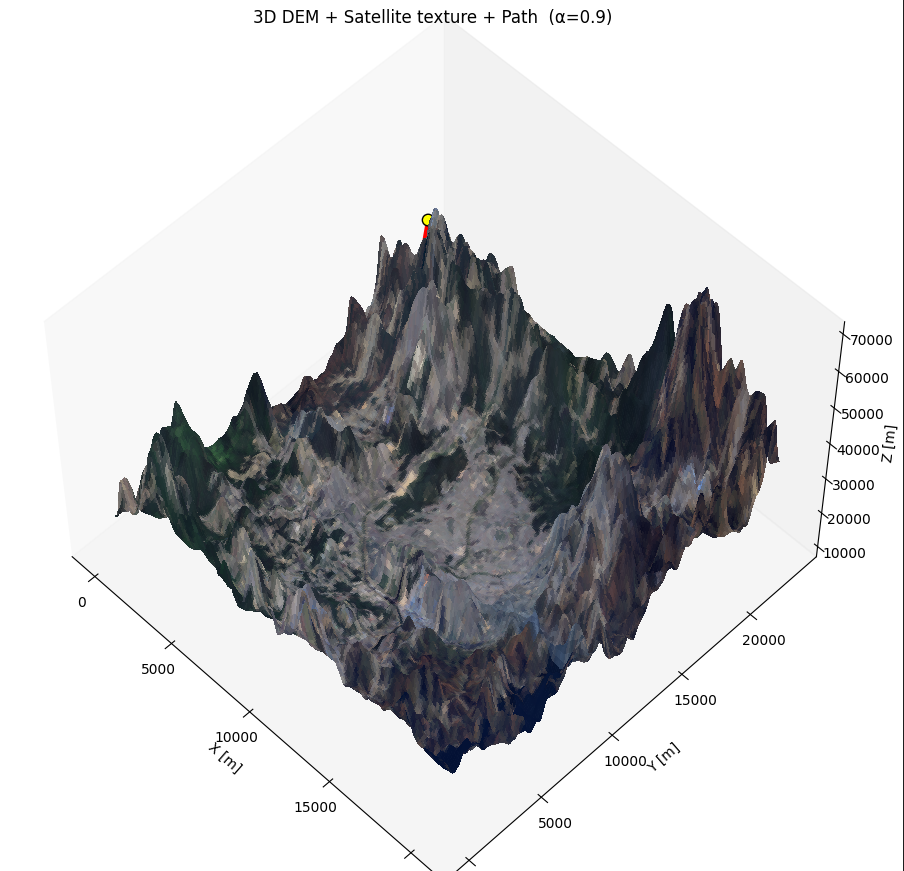

### 4. A* (A-star) 알고리즘을 이용한 경로 탐색

- 다음과 같이 weight를 커스터마이징 할 수 있다.


- weight을 설정하고 path를 구하면 아래와 같이 나오게 된다.

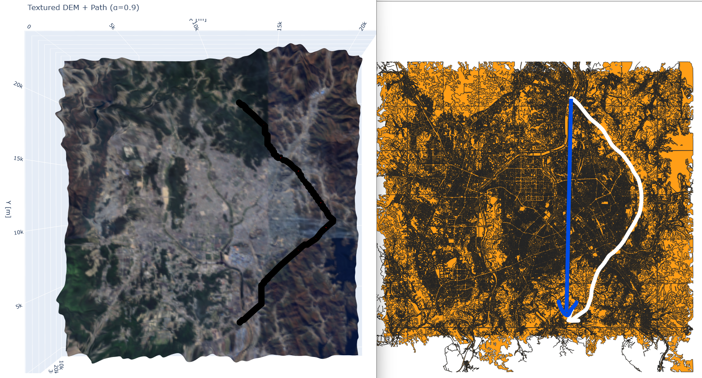

- weight가 없는 상황이였으면 직선거리고 탐색을 하였을 상황인데, 해당 shp에 맞게 도로를 중심으로 경로를 탐색함을 확인할 수 있다.


### V. 결론

본 연구에서는 위성지도와 DEM 데이터를 통합적으로 활용하여,
재난 상황에서의 골든타임 확보를 위한 지형 기반 최적 대피로 탐색 시스템을 구축하였다.
위성 영상으로부터 이동 가능한 영역을 세그멘테이션(Object Detection)으로 정밀하게 추출하고,
저해상도 DEM 데이터를 DCT(Discrete Cosine Transform) 기반의 연속 함수로 변환함으로써
지형의 연속성을 확보하였다.
또한, Shapefile을 기반으로 도로·건물·수역 등 공간 객체별로 가중치를 설정하고
A* 알고리즘을 적용하여 실제 사람이 이동 가능한 경로를 탐색하였다.

이러한 접근을 통해 기존의 단순한 “최단 거리 기반 경로 탐색”이 아닌,
지형, 통행 가능성, 시간 효율성을 모두 고려한 현실적인 최적 경로를 계산할 수 있었다.
특히, DEM을 함수 형태로 근사하여 고도 변화에 따른 이동비용을 반영하고,
위성지도에서 추출한 가중치 정보를 함께 고려함으로써
도로를 중심으로 한 자연스럽고 효율적인 경로 형성이 가능해졌다.

### VI. 기대효과

#### 1. 재난 대응 효율성 향상

- 화재·홍수·지진 등 재난 상황에서의 골든타임 확보에 직접 기여할 수 있다.

- 실시간 대피 경로 제공 및 구조 인력의 이동 경로 최적화를 통해
인명 피해를 최소화할 수 있다.

#### 2. 응급 의료 이송 체계 개선

- 병원·119 구조대 등 응급기관이 활용할 경우,

- 이송 소요 시간을 최소화하는 실시간 경로 추천이 가능하다.

- 교통 상황이나 지형적 제약이 큰 지역에서도 신속한 대응이 가능하다.

#### 3. 스마트시티 및 재난 대응 인프라 활용

- 구축된 시스템은 IoT 센서, 교통 데이터, 실시간 기상정보 등과 연동되어
도시 단위의 실시간 대피 안내 서비스로 확장될 수 있다.

- 향후 스마트시티 플랫폼 내 AI 기반 재난 대응 모듈로 통합 가능하다.

#### 4. 확장성 및 자동화 가능성

- 위성지도, DEM, SHP 데이터를 자동으로 수집·처리하는 파이프라인을 통해
전국 단위 자동 업데이트 시스템 구축이 가능하다.

- Super-Resolution 및 세그멘테이션 모델의 성능 향상에 따라
지속적인 품질 개선이 가능하다.