# Terrain-Based Optimal Evacuation Route Search System for Securing Golden Time

## I. Introduction

Route selection in war situations is not just a movement problem but a core element directly linked to survival. In particular, how quickly and safely casualties occurring during combat are evacuated is one of the most important variables determining mortality rates. According to a JAMA Surgery report, the survival rate of patients who received professional medical treatment within 1 hour of injury was significantly higher, and it was empirically presented that mortality and complication rates increase rapidly if evacuation is delayed. This shows that the efficiency of movement time and movement routes on the battlefield has a direct impact on the patient's survival rate.

In addition, the study 'Impact of prehospital medical evacuation (MEDEVAC) transport time on combat mortality in patients with non-compressible torso injury and traumatic amputations' revealed that the shorter the MEDEVAC transport time, the statistically significantly lower the combat mortality rate, and especially for severe trauma patients, delayed transport time leads directly to increased fatality rates. This study emphasizes that beyond the problem of simple medical equipment, the movement route within the battlefield and the actual possibility of movement itself determine the survival rate.

Accordingly, military medical systems, including the US military, have set the 'Golden Hour' for combat casualties as a key standard and are operating a system to evacuate them to a surgical team within 1 hour of injury. According to the study "The Golden Hour of Casualty Care" published in 2024, the 24-hour mortality rate of soldiers handed over to the surgical team within 1 hour after injury during combat was confirmed to be significantly lower than those who were not. In particular, for hemorrhagic trauma patients, the survival rate tended to decrease rapidly as the evacuation time exceeded 1 hour. This shows that even in war situations, the efficiency of movement time and movement routes after injury is a structural factor that determines survival rates. In other words, securing the shortest and optimal route on the battlefield is not a matter of simple movement convenience, but a key task that determines the soldier's life and ability to sustain operations.


<div style="display: flex; justify-content: space-around; align-items: center;"> 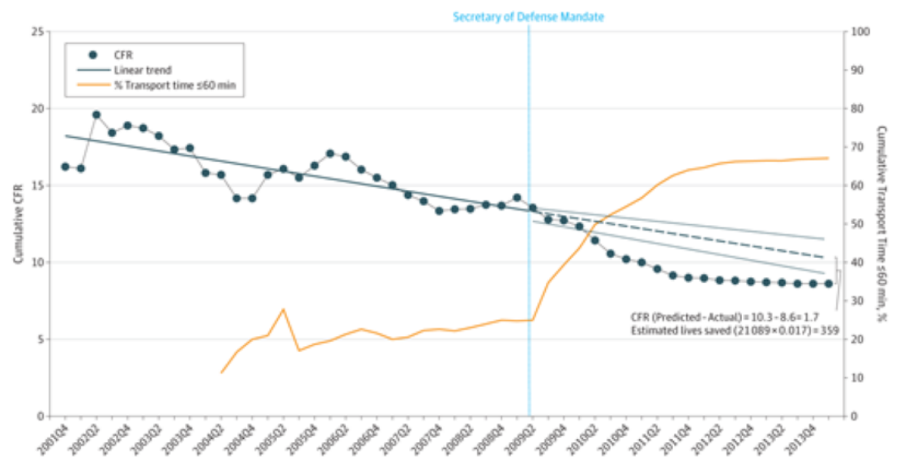 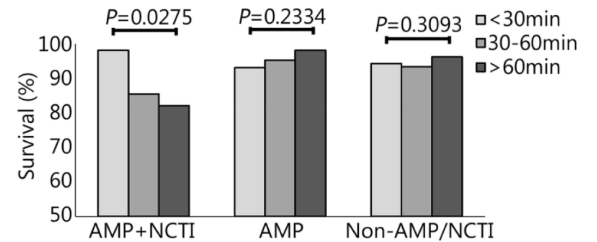</div> <br>

This study started from this awareness of the problem. In order to increase the survival rate of soldiers and civilians in war situations, we explored a method to search for optimal routes that are actually movable even in complex battlefield environments. Through this, we aim to build a realistic route search system that comprehensively considers terrain constraints, movable areas, risk levels, and time efficiency, rather than simple shortest distance calculations.


## II. Technical Background


### 1. Object Detection

Object detection in satellite images is not just a task of distinguishing objects, but a key step in separating **areas where people can actually move (roads, sidewalks, open fields, etc.)** and **areas where movement is impossible (buildings, forests, water bodies, etc.)**.

Object Detection or Segmentation learns a function $f_\theta$ that classifies the input image $I(x, y)$ into each class $C_k$.

$$
f_\theta: \mathbb{R}^{H \times W \times 3} \rightarrow \{C_1, C_2, ..., C_K\}^{H \times W}
$$

Here, $C_k \in \{\text{road}, \text{building}, \text{river}, \text{forest}, ...\}$.
Learning proceeds mainly with cross-entropy loss.

$$
\mathcal{L}_{seg} = - \sum_{x,y} \sum_{k=1}^{K} p_{k}(x,y) \log q_{k}(x,y)
$$

- $p_k(x,y)$: Ground truth (one-hot) distribution
- $q_k(x,y) = f_\theta(I(x,y))$: Model's predicted probability

Through this result, a pixel-level Label Map is created, and this is **vectorized (Polygonization)** to convert it into a Shapefile (SHP).
This SHP file is later used as a **Weight Map** for route search.

---

### 2. Super-Resolution

If the resolution of the satellite image is low, object boundaries become blurred and the segmentation model incorrectly predicts boundary lines.
To solve this, **Super-Resolution** techniques are applied.

The basic formula for Super-Resolution is as follows:

$$
I_{HR} = G_\phi(I_{LR}) \quad \text{with} \quad \min_\phi \; \mathcal{L}(I_{HR}, \hat{I}_{HR})
$$

- $I_{LR}$: Low-resolution input image
- $I_{HR}$: High-resolution target image
- $G_\phi$: Restoration network (e.g., EDSR, ESRGAN, etc.)
- $\mathcal{L}$: Restoration loss (MSE, Perceptual Loss, etc.)

Typically, **ESRGAN** uses Perceptual + Adversarial loss as follows:

$$
\mathcal{L}_{total} = \mathcal{L}_{pixel} + \lambda_1 \mathcal{L}_{perceptual} + \lambda_2 \mathcal{L}_{adv}
$$

This reinforces the structural details of the image (road boundaries, river contours, etc.) and improves the **segmentation accuracy (Intersection-over-Union, IoU)** in the subsequent step.

---

### 3. DCT (Discrete Cosine Transform)

DEM (Digital Elevation Model) is a matrix $Z[i,j]$ that samples altitude at regular grid intervals.
However, if the grid interval is around 90m, the surface appears stepped, causing **discontinuous altitude changes**.
To approximate this as a continuous function $f(x, y)$, **Discrete Cosine Transform (DCT)** is used.

The DCT-II transform formula is as follows:

$$
F(u,v) = \alpha(u)\alpha(v) 
\sum_{x=0}^{M-1}\sum_{y=0}^{N-1} 
Z(x,y) \cos\left[\frac{\pi(2x+1)u}{2M}\right] 
\cos\left[\frac{\pi(2y+1)v}{2N}\right]
$$

The inverse formula (Inverse DCT) is as follows:

$$
f(x,y) = 
\sum_{u=0}^{M-1}\sum_{v=0}^{N-1}
\alpha(u)\alpha(v)F(u,v)
\cos\left[\frac{\pi(2x+1)u}{2M}\right]
\cos\left[\frac{\pi(2y+1)v}{2N}\right]
$$

Here,
$$
\alpha(u) = 
\begin{cases}
\frac{1}{\sqrt{M}}, & u = 0 \\
\sqrt{\frac{2}{M}}, & u > 0
\end{cases}
$$

If only the low-frequency region (small u, v) of the DCT coefficients $F(u,v)$ is left and the high frequency is removed, **gradual changes in the terrain can be maintained while noise and step effects are suppressed**.
In other words, $f(x,y)$ acts as a **continuous and smooth approximation function** of the DEM.

---

### 4. A* (A-star) Algorithm

The A* algorithm is a **Heuristic-based shortest path search** algorithm.
For each node \( n \), the total cost \( f(n) \) is defined as follows:

$$
f(n) = g(n) + h(n)
$$

- $g(n)$ : Actual accumulated cost from the start point to the current node
- $h(n)$ : Estimated cost to the goal point (Heuristic)

In an 8-direction grid, **Euclidean distance** or **Octile distance** is used as the heuristic.

$$
h(n) = \sqrt{(x_{goal} - x_n)^2 + (y_{goal} - y_n)^2}
$$

Or

$$
h(n) = D \cdot (dx + dy) + (D_2 - 2D) \cdot \min(dx, dy)
$$

- $D, D_2$ : Movement unit cost (usually D=1, D₂=√2)
- $dx = |x_{goal} - x_n|, \; dy = |y_{goal} - y_n|$

If the Weight map is $W(x,y)$, the movement cost of each edge is defined as follows, considering the altitude difference and weight together:

$$
c(n,m) = W(x_m, y_m) \cdot \sqrt{(x_m-x_n)^2 + (y_m-y_n)^2} \cdot (1 + \lambda |\nabla f(x_m, y_m)|)
$$

Here,
- $|\nabla f|$ : Rate of change of altitude (slope-based penalty)
- $\lambda$ : Slope sensitivity adjustment coefficient

As a result, A* finds not simply the **shortest distance**, but the "**path that is easiest to move and reflects the actual terrain**".


## III. Implementation

### 1. Yolo segmentation

- The Environmental Spatial Information Service (https://aid.mcee.go.kr/) provides land cover maps as follows.

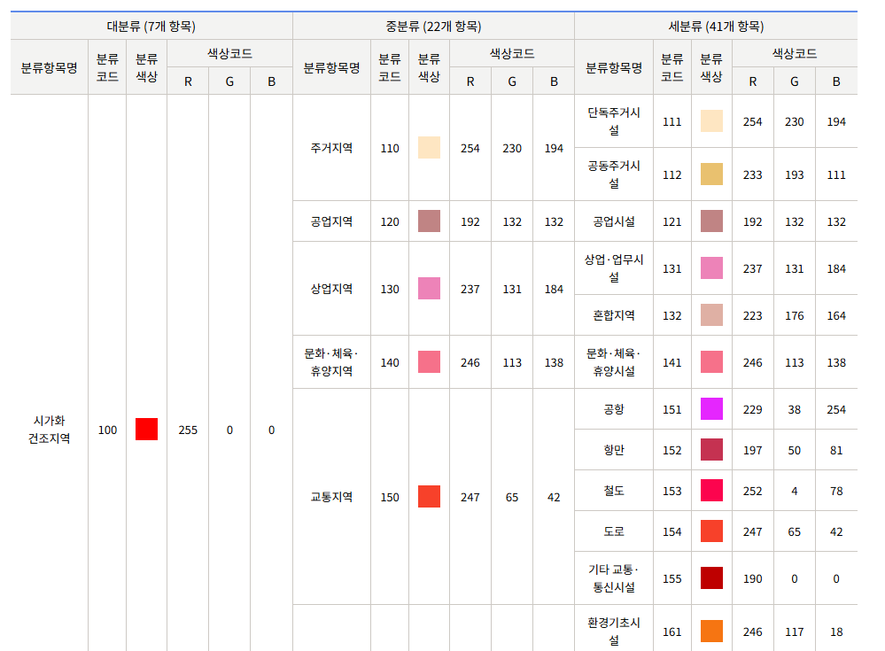

- As shown in the picture, shp files are provided in 41 sub-classifications. The goal is to extract 41 objects from satellite maps as shown below using YOLO-segmentation.

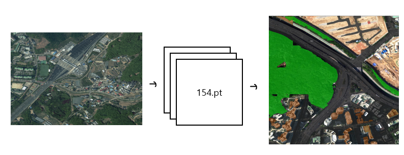


- We fine-tuned Ultralytics' yolov11-seg.pt as the base model to fit the data.

- Tiling was performed with the satellite map zoom level = 18, and segmentation labeling was performed to train an average of 2,500 data per class.

- As a result of performing extraction based on satellite photos of Daejeon, we were able to extract as follows.


<video controls src="img/segmentation.mp4" title="Title"></video>


### 2. SuperResolution

- In order to achieve better detection performance for the above segmentation, it was identified that higher quality photo resolution was needed. Therefore, we decided to proceed with extraction using the SuperResolution technique as a pre-processing step.

- Since the .tif file contains not only simple photo information but also various metadata such as location information, the following steps must be taken.

```
1. Save metadata of .tif file separately -> data
2. Split .tif file into .png format data -> Save in {z = 18}/{x}/{y}.png format
3. Proceed with upscaling for each
4. Merge the .png files again and reconstruct the tif file by adding metadata (data)
```

The result can be confirmed as follows.

<video controls src="img/SuperResolution.mp4" title="Title"></video>

- After going through this process, the result of SuperResolution -> Yolo-segmentation detection in the Daejeon area is as follows.

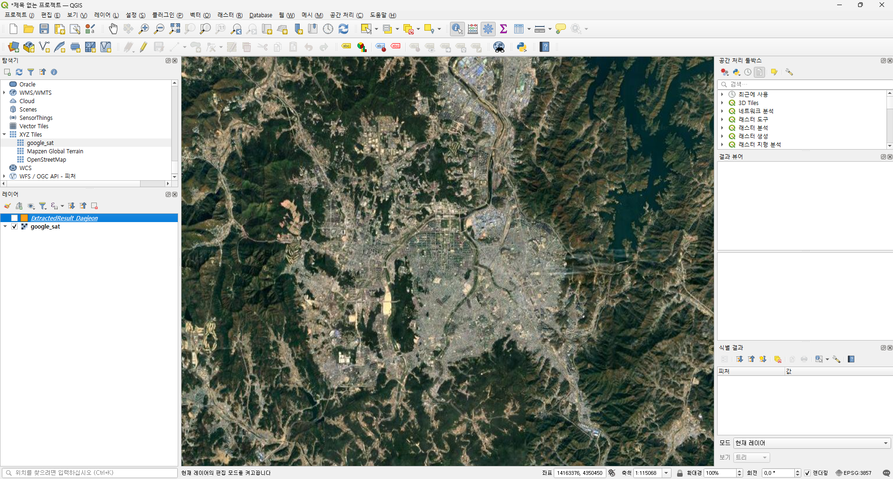

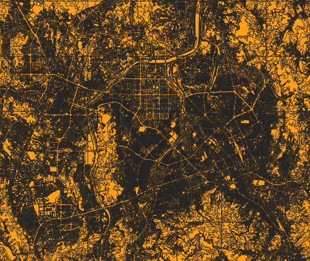


### 3. DEM Data DCT Transformation

- We were able to receive nationwide altitude data from the Public Data Portal (https://www.data.go.kr/).
- However, since the data was 90m class data, it was judged that DCT transformation was necessary.
- In order to unify with the coordinate system of the land cover map, conversion work was performed to fit the EPSG:3857 projection.

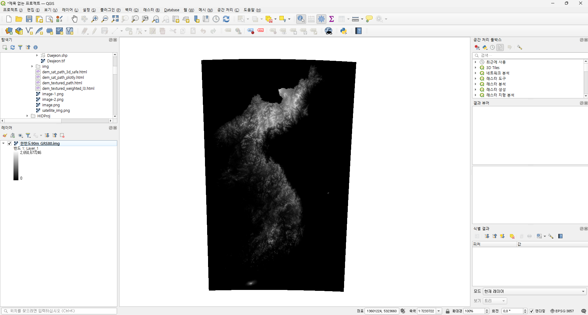

- Among them, the Daejeon area was cut and transformed.

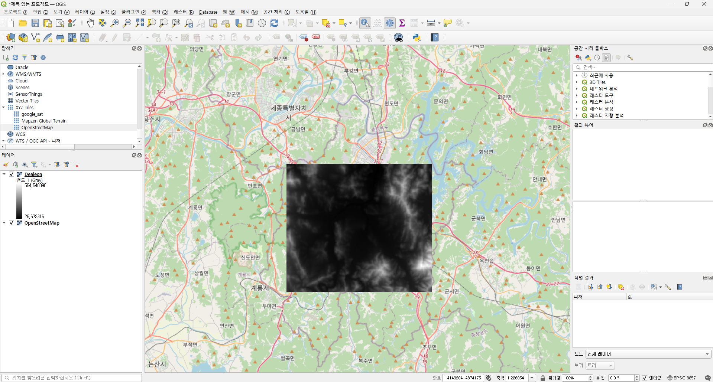

- The processing result of the data is as follows, and it can be confirmed that there is no significant distortion from the original.

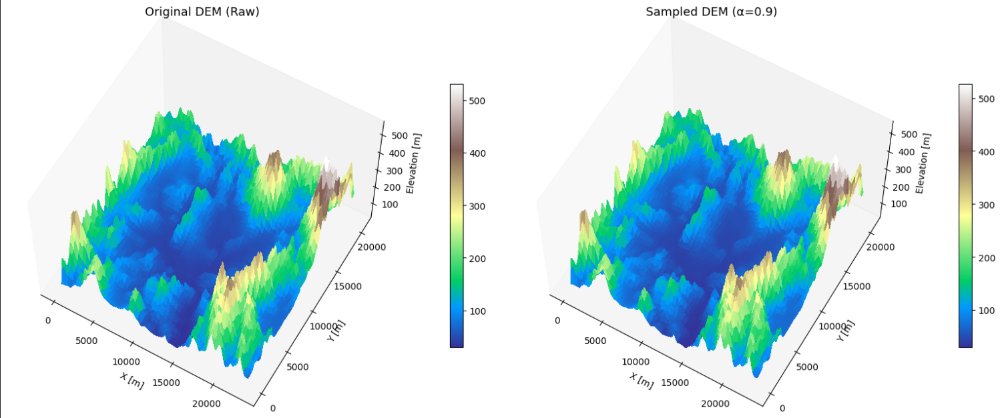

- The extracted formula is as follows.

$$
f(x, y) = 
\sum_{k=0}^{K_c} \sum_{\ell=0}^{L_c}
A_{k\ell}
\cos\left( \frac{\pi k x}{W_m} \right)
\cos\left( \frac{\pi \ell y}{H_m} \right)
$$


| Item | Value | Meaning |
|------|------|------|
| shape | (180, 204) | Shape( $A_{kl}$ ) |
| $W_m$ | 20,538.49 | Total X-axis length (m) |
| $H_m$ | 23,292.26 | Total Y-axis length (m) |
| $Kc$, $Lc$ | (81, 91) | DCT coefficient limit index |

<br>

- If you upload a satellite photo to the mesh, it will appear as follows.

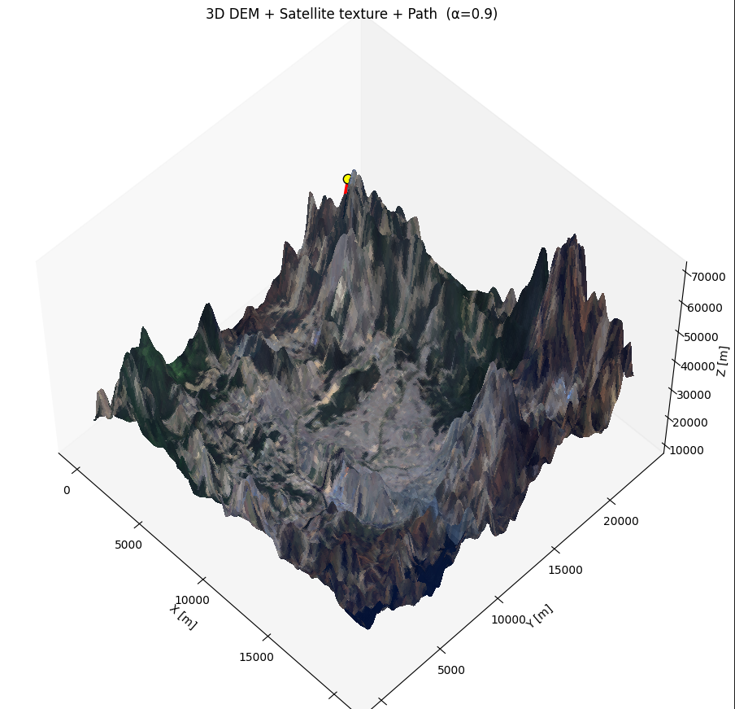

### 4. Path Finding using A* (A-star) Algorithm

- You can customize the weight as follows.

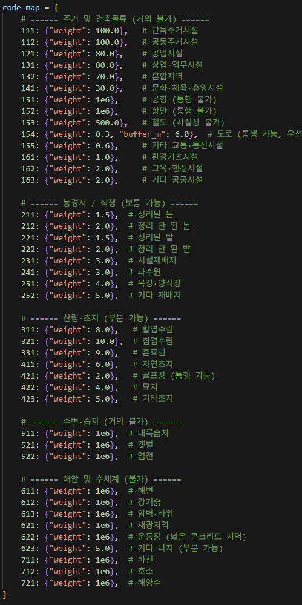

- If you set the weight and find the path, it will appear as follows.

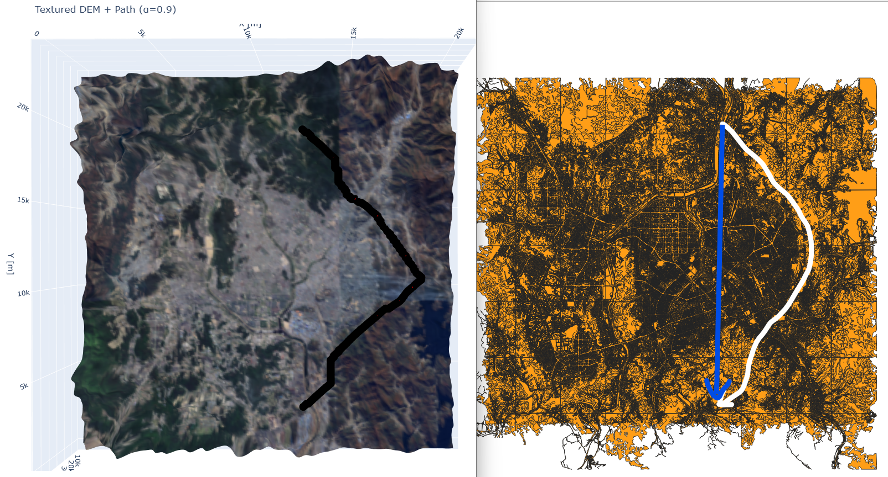

- If there were no weights, it would have searched for a straight line distance, but it can be confirmed that the path is searched centering on the road according to the shp.

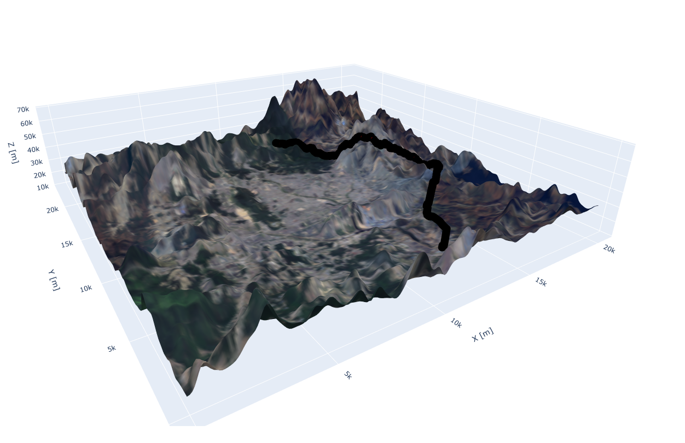
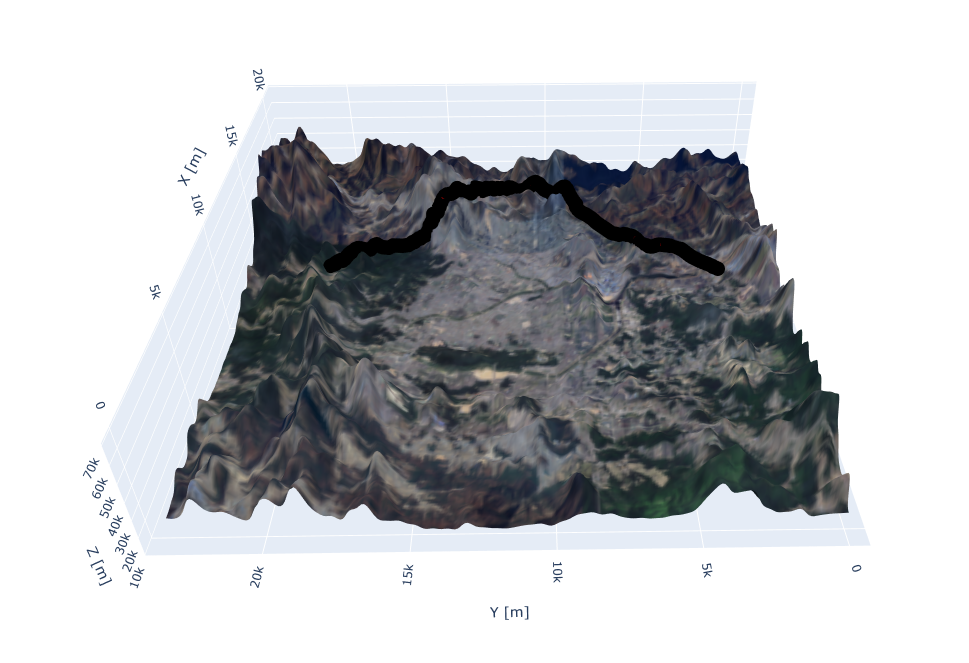

### V. Conclusion

In this study, we built a terrain-based optimal evacuation route search system to increase the survival probability of soldiers and civilians and secure golden time in war and disaster situations by integrating satellite maps and DEM data. Movable areas were precisely extracted from satellite images using segmentation (Object Detection), and low-resolution DEM data was converted into a continuous function based on DCT (Discrete Cosine Transform) to secure terrain continuity. In addition, weights were set for each spatial object such as roads, buildings, and water bodies based on Shapefiles, and the A* algorithm was applied to search for routes that actual people can move.

Through this approach, it was possible to calculate a realistic optimal route that considers terrain, passability, risk, and time efficiency, rather than the existing simple "shortest distance-based route search". In particular, by approximating the DEM in the form of a function to reflect the movement cost according to altitude changes, and considering the weight information extracted from the satellite map together, it became possible to form a natural and efficient route centered on roads while avoiding dangerous areas.


### VI. Expected Effects

#### 1. Military Operation and Troop Protection Effects

- The risk of troop exposure can be minimized by providing real-time optimal routes. 

- The safety and speed of rear departure, evacuation of wounded soldiers, and supply support can be improved.


#### 2. Improvement of Civilian Evacuation and Humanitarian Aid

- It can be used to guide civilian movement routes within combat zones.

- Accessibility for emergency rescue personnel and medical organizations can be improved. 

#### 3. Scalability of Smart Route System Based on Battlefield Situational Awareness

- Real-time updates are possible by linking with drone reconnaissance video, thermal imaging, and engagement zone data.

- It can be integrated into an AI automatic route search module within the military command system in the future.

#### 4. Possibility of Automated Information Update on a Nationwide and Battlefield Scale

- It is possible to update and expand war zones through the construction of a pipeline that automatically collects and processes satellite maps, DEM, and SHP data.

- Continuous quality improvement is possible according to the development of Super-Resolution and segmentation technologies.